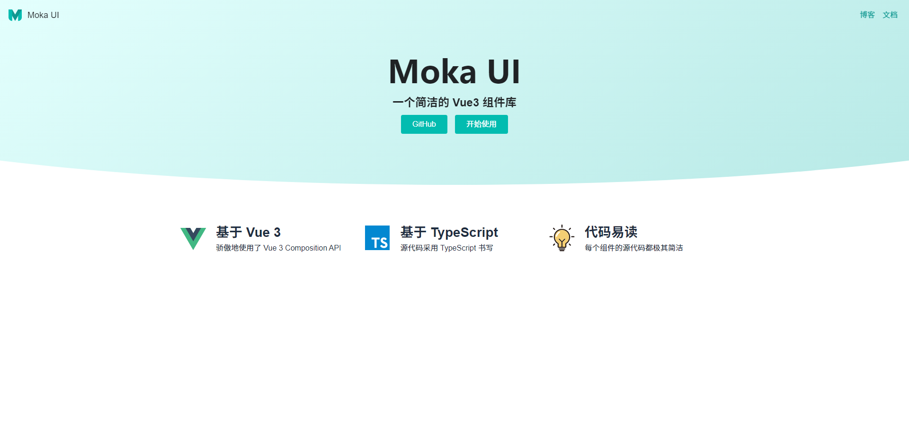

# Moka-Vue3-UI


[](https://badge.fury.io/js/moka-vue3-ui)


Moka-Vue3-UI 是一个基于 Vue3 + TypeScript 的 UI 组件库。

## 文档

可在线查看示例代码，支持 PC 和手机浏览：[https://ygcedu.github.io/moka-vue3-ui](https://ygcedu.github.io/moka-vue3-ui)


## 特性

- 涵盖了Button、Switch...等常见 UI 组件。
- 模块化的源代码简洁明了，易于阅读。
- 基于 Vue3，使用了 setup、onMounted、watchEffect、ref、computed 等 Composition API。

## 安装

```bash
$ yarn add moka-vue3-ui
```

```bash
$ npm install moka-vue3-ui --save
```

## 示例

```vue

<template>
  <div>
    <Button>按钮</Button>
  </div>
</template>

<script>
import {Button, Tabs, Tab, Switch, Dialog, openDialog} from "moka-vue3-ui"

export default {
  components: {Button}
}
</script>
```

引入样式：

```javascript
import {Button, Tabs, Tab, Switch, Dialog, openDialog} from "moka-vue3-ui"
```

## 许可

Moka-Vue3-UI 使用 [MIT license](https://opensource.org/licenses/MIT) 许可证书。

### 待开发

- [x] 统一书写 CSS 变量
- [x] 一键部署脚本
- [x] 实现页面顶部进度条效果
- [ ] 添加新组件：Menu、Popover、Datepicker、Tooltip、LinearProgressIndicator 等
- [ ] 使用 JSX
- [ ] 使用 defineComponent，支持泛型，更好地配合 TypeScript